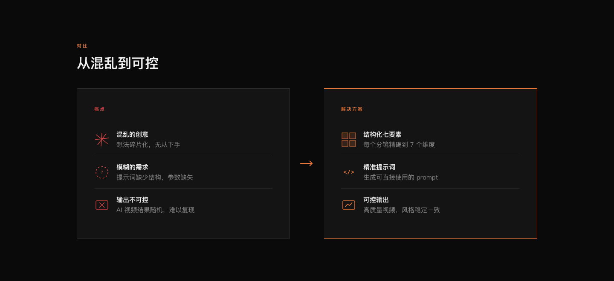
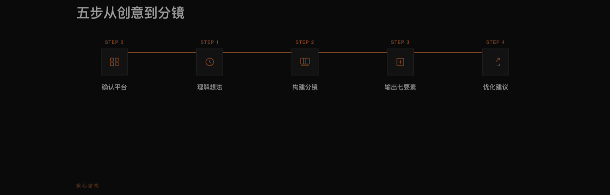
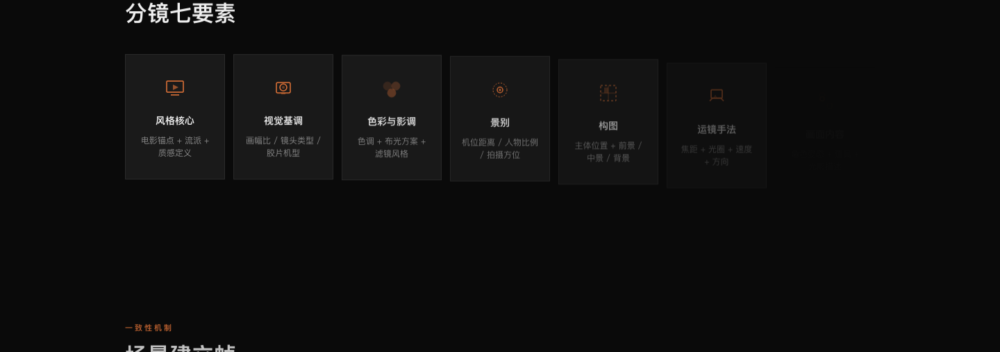
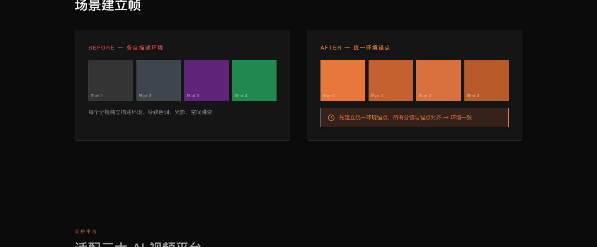
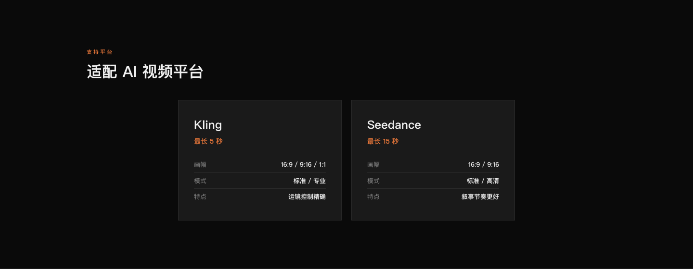

# Storyboard Scavenger｜AI 视频分镜与提示词生成 Skill

> 把创意、参考图或音乐想法整理成 AI 视频分镜提示词，提供可灵 Kling 与即梦 Seedance 的专门工作流。

<p align="center">
  
</p>

---

> [!TIP]
> 🎁 扫码关注公众号「欧八同学」，免费领取 AI 案例与 Skill《大厂产品AI经验编程 200 套》→ [去扫码](#author)

[使用示例](#quick-example) · [开始使用](#quick-start) · [English](#english-overview)

<a id="quick-example"></a>

## 一次使用示例

**虚构输入：**「做一段可灵产品短片：雨夜街头，一双白鞋踏过积水。先给环境建立帧，再拆成独立镜头。」

**输出结构示例：** 环境锚点先确定湿路面、冷色街灯和雨夜；一个镜头按七要素写成：风格核心＝写实产品短片，视觉基调＝9:16／24mm，色彩影调＝冷灰蓝与暖色反光，景别＝低机位近景，构图＝白鞋位于下三分之一，运镜＝24mm／低速横移／跟随鞋尖，画面内容＝鞋底踏水、涟漪向外扩散。最终分镜还会按所选平台工作流组织。

这是格式示例，不是已生成的视频。完整案例见 [分镜提示词案例集](examples/example-prompts.md)，也可直接使用 [分镜模板](templates/storyboard-template.md)。

## 这是什么？

一个**结构化的 AI 视频分镜提示词生成方法论**。不管你的创意有多模糊——一句话、一张图、一段 BGM——这个 Skill 都能帮你拆解成：

- **七要素结构化分镜**（风格核心 / 视觉基调 / 色彩影调 / 景别 / 构图 / 运镜手法 / 画面内容）
- **场景建立帧**（环境一致性锚点，帮助减少多分镜环境跳变）
- **38 种运镜技巧库**（含参数：焦距、光圈、速度、方向）
- **电影参考锚点**（每个分镜必须锚定电影风格 DNA）

<p align="center">
  
</p>

## 支持平台

下表描述仓库内现有写作工作流，不是平台最新能力上限或本轮实机验证结论；生成前请在目标平台核对当前限制。

| 平台 | 本仓库工作流中的单段时长 | 语言 | 特色 |
|------|---------|------|------|
| **Kling（可灵）** | ≤5s | 中文 | 独立分段，每段自包含 |
| **Seedance（即梦）** | ≤15s | 中文 + `@素材` 语法 | 多模态组合，视频延长 |

## 核心工作流

<p align="center">
  
</p>

```
Step 0: 确认目标平台（Kling / Seedance）
         ↓
Step 1: 理解用户想法 + 深入挖掘细节
         ↓
Step 2: 构建分镜结构（七要素 + 电影参考锚点 + 场景建立帧）
         ↓
Step 3: 输出七要素分镜（平台映射 + 标准模板）
         ↓
Step 4: 优化建议 + 特殊镜头技巧
```

## 七要素结构（每个分镜必须完整）

<p align="center">
  
</p>

| 要素 | 说明 | 示例 |
|------|------|------|
| **风格核心** | 电影锚点 + 流派 + 质感 + 杜绝什么 | 《银翼杀手2049》[Villeneuve/Deakins]，赛博朋克noir... |
| **视觉基调** | 画幅/胶片机型/镜头 | 9:16竖屏，24mm广角F2.4 |
| **色彩与影调** | 时代美学+主色+颗粒+布光 | 冷灰蓝+肌肤暖色点缀，自然光 |
| **景别** | 机位角度+人物比例+方位 | 地面仰拍5°，腿部占60% |
| **构图** | 主体位置+前景/背景 | 双腿居中纵向延伸 |
| **运镜手法** | 焦距+光圈+运动+速度+方向（≥3参数） | 24mm F2.4，固定机位 |
| **画面内容** | 角色姿态+道具+光影 | 白色厚底鞋→小腿→膝盖→大腿 |

## 场景建立帧机制

多分镜视频最常见的翻车点 = **环境跳变**（分镜1暖光木地板 → 分镜2冷光水泥地）。

**解决方案**：在正式分镜前先生成一张纯环境锚点图，所有后续分镜的环境要素必须与此帧对齐。

<p align="center">
  
</p>

```
场景建立帧 → 定义空间布局/光源色温/色调/材质/道具/天气
     ↓
分镜01~N → 环境描述必须与建立帧对齐，仅允许因运镜角度不同产生的视角差异
```

## 目录结构

```
├── SKILL.md                              # 完整 Skill 文档（主入口）
├── quick-reference.md                    # 快速参考卡
├── references/
│   ├── lens-techniques-38.md             # 38种运镜技巧库
│   ├── seedance-prompt-patterns.md       # Seedance 2.0 提示词模式
│   ├── kling-storyboard-workflow.md      # Kling 实战工作流
│   └── cyberpunk-rain-night-example.md   # 完整七要素分镜范例（14镜+3段CRT）
├── templates/
│   └── storyboard-template.md            # 分镜模板（4种场景类型）
└── examples/
    └── example-prompts.md                # 实战案例集
```

<a id="quick-start"></a>

## 使用方式

### 装进你的 AI Agent

任何支持 `SKILL.md` 技能约定的 Agent 都能使用它。以常见的用户级技能目录为例：

```bash
git clone https://github.com/ouxxyy/storyboard-scavenger.git ~/.agents/skills/storyboard-scavenger
```

装好后对 Agent 说「帮我把这个想法做成 AI 视频分镜」或直接提到可灵 / 即梦，Skill 会自动接管，按 Step 0–4 的流程走完并输出七要素分镜。

### 当作写作手册

不装 Agent 也可以直接读：

- [`SKILL.md`](SKILL.md) —— 完整方法论（主入口）
- [`quick-reference.md`](quick-reference.md) —— 快速参考卡
- [`examples/example-prompts.md`](examples/example-prompts.md) —— 实战案例集

## 可视化说明

打开 [`visual-guide.html`](visual-guide.html) 查看带动画的交互式 Skill 说明页（电影感暗色调，双击即可在浏览器中打开）。

<p align="center">
  
</p>

## 版本历史

| 版本 | 日期 | 更新 |
|------|------|------|
| v3.0 | 2026-06-12 | 新增「场景建立帧」机制 + 分镜场景锚点字段 + 环境一致性规则 |
| v2.0 | 2026-06-07 | 七要素结构化 + 38种运镜库 + Seedance 2.0 提示词模式 |
| v1.0 | 2026-04-11 | 初始版本 |

## 常见问题

### 它会直接生成视频吗？

主要产物是分镜与提示词。视频生成需要在目标平台完成，成本和可用能力以该平台为准。

### Kling 和 Seedance 都有专门写法吗？

仓库分别提供 [Kling 工作流](references/kling-storyboard-workflow.md) 和 [Seedance 提示词模式](references/seedance-prompt-patterns.md)。其他模型的通用借鉴，不等于经过验证的平台专属支持。

### 为什么仓库名和技能名不同？

仓库品牌是 Storyboard Scavenger，现有 `SKILL.md` 标识是 `seedance-storyboard`。安装目录示例沿用仓库名，使用时可直接描述任务；具体识别和调用方式以宿主为准。

### 能保证多个镜头的环境完全一致吗？

场景建立帧用于减少环境描述漂移，不能保证生成平台每次都输出完全一致的画面。

<a id="english-overview"></a>

## English overview

Storyboard Scavenger is an AI video storyboard and prompt-writing Agent Skill for Kling and Seedance. Give it an idea, reference image or music concept; it organizes seven-element shot descriptions, an establishing frame and camera-movement references. It writes prompts rather than rendering a finished video.

Start with the [installation and usage instructions](#quick-start), or read [SKILL.md](SKILL.md) and the [worked examples](examples/example-prompts.md). The existing skill identifier is `seedance-storyboard`. Dedicated platform guides describe this repository's workflow, not a guarantee of current model limits or visual consistency.

## 相关项目

[欧八同学的 AI Skills 与跳槽涨薪工具合集](https://github.com/ouxxyy/ouba-classmate)，还可以接着使用：

- [把旅行照片制作成离线翻页画册](https://github.com/ouxxyy/travel-art-album-skill)
- 全部项目与作者主页：[github.com/ouxxyy](https://github.com/ouxxyy)

<a id="author"></a>

## 作者

作者全平台同名：**欧八同学**。

- 个人主页 / 联系我：[albertou.redboook.cn](https://albertou.redboook.cn/)
- 微信公众号：扫码关注，免费领取 AI 案例与 Skill《大厂产品AI经验编程 200 套》，免费领取 AI 案例与 Skill《大厂产品AI经验编程 200 套》
- 抖音：[搜索“欧八同学”](https://www.douyin.com/search/%E6%AC%A7%E5%85%AB%E5%90%8C%E5%AD%A6)
- 小红书：[搜索“欧八同学”](https://www.xiaohongshu.com/search_result?keyword=%E6%AC%A7%E5%85%AB%E5%90%8C%E5%AD%A6)
- X：[搜索“欧八同学”](https://x.com/search?q=%E6%AC%A7%E5%85%AB%E5%90%8C%E5%AD%A6&src=typed_query)

<p align="center">
  
</p>

<p align="center"><sub>扫码关注「欧八同学」，免费领取《大厂产品AI经验编程 200 套》</sub></p>

如果这个 Skill 帮你拍出了满意的视频，欢迎点个 Star；分镜翻车的案例也欢迎提 Issue，附上你的提示词和生成结果链接即可。

## License

[MIT](LICENSE)
